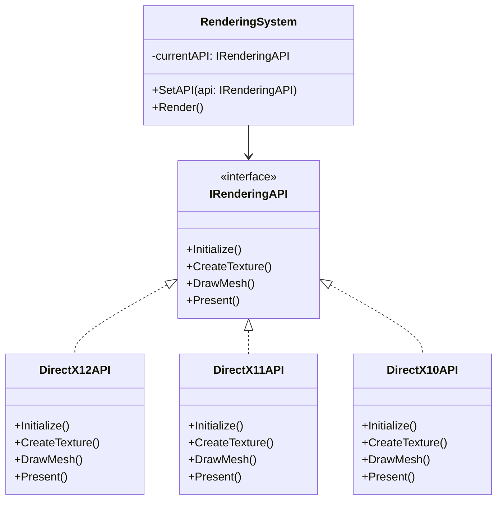
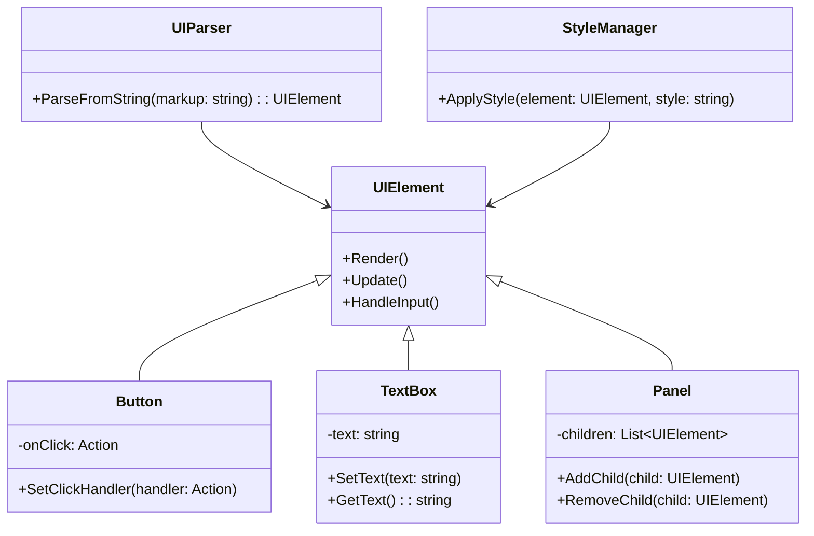
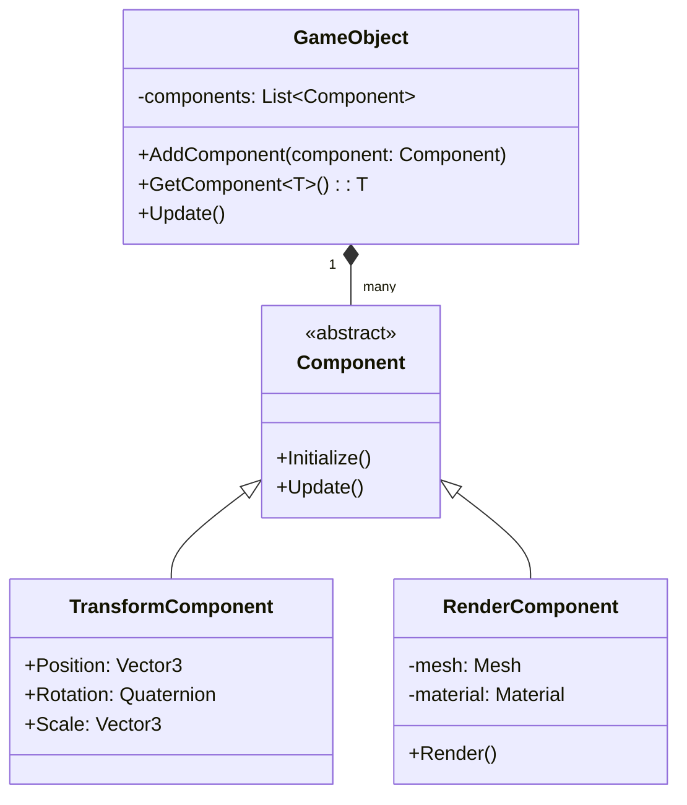
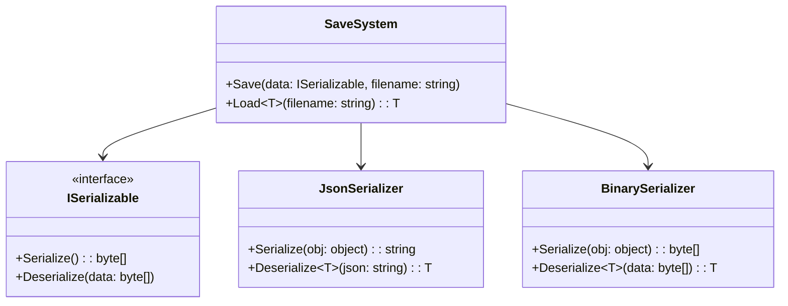
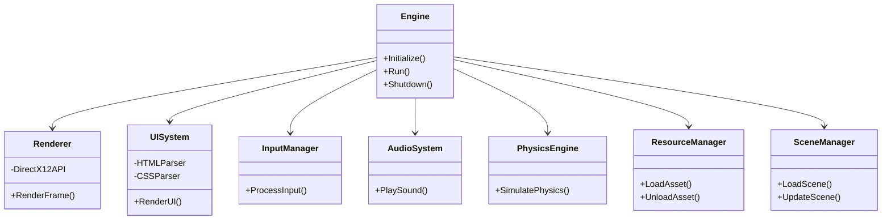

# Game Engine Architecture Overview

This document provides an overview of the architecture for our custom game engine, including diagrams for various
subsystems.

## Switchable DirectX Architecture

## UI System Architecture

## GameObject System Architecture

## Data Saving System Architecture

## Core Game Engine Architecture

This document provides a high-level overview of the architecture for our custom game engine. Each diagram represents a
key subsystem of the engine, showing the relationships between major components and classes.

As the engine development progresses, these diagrams should be updated to reflect any changes in the architecture. They
serve as a valuable reference for understanding the overall structure of the engine and how different parts interact
with each other.
